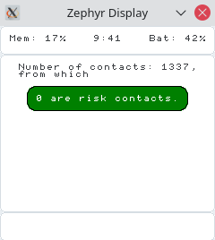
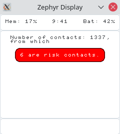

# Contact Tracing Wristband [](https://github.com/CovidBraceletPrj/CovidBracelet/actions) [](https://github.com/CovidBraceletPrj/CovidBracelet/actions)

This project aims to add support the [Exposure Notification (EN) protocol for tracing contacts from Apple and Google](https://covid19.apple.com/contacttracing) on low-power wristbands. It maintains full compatibility with smartphone Apps based on the EN protocol.

**Note: this is a proof of concept and not ready for production**  
**Contributions Welcome!** 

## Features
* Builds on Zephyr OS targetting the NRF52 BLE SOCs
* Easy project setup using [PlatformIO](https://platformio.org/platformio-ide)
* Sends and receives exposure beacons as specified by Google and Apple for Covid Contact Tracing
  * Rolling, encrypted, anonymous beacons 
  * Compatible with Apple iOS and Android phones
  * With rolling proximity identifiers and encrypted metadata
  * Proximity identifiers and BLE addresses change every 10 minutes
* Stores own keys for 14 days
* Stores contacts of more than 5 minute duration
* Upon infection upload keys to a public database
* Retrieve keys of infections from database
  * computes rolling proximity identifiers 
  * compares to stored contacts to check for exposure

Note: as we for now do not use the flash for key storage, this currently only works on nrf52480 or you can just store a very small number of keys. Moving the keys to flash is on the TODO list and will fix this. 

## Getting Started
This project is based on platformIO for an easy setup process, see: [https://platformio.org/platformio-ide](https://platformio.org/platformio-ide).


## Testing
To run the tests for the desktop environment select the task *test* for desktop or run:

```
platformio test -e desktop
```

## Demo Video

[](https://youtu.be/tYGsFJC3LtE)

## Roadmap

### Flash Support
* Store long-term contacts in flash

### Device Initialization
The devices need to be initialized:
* Fix entropy: keys are always the same on boot up
* Synchronize time
* Set device name, user id or so in Flash (-> persistend configuration)

### Device Synchronization
* Extend beyond the simple (existing) basestation
* Synchronize time
* Get infections from DB, Check their signatures
* Secure GATT services and authentication of base statation in general
* Read keys form national databases
  * Functions to extract keys from googles official [exposure key export file format](https://developers.google.com/android/exposure-notifications/exposure-key-file-format) are already implemented
  * For full integration the keys have to be downloaded from the national servers (due to limited memory an intermediate server which provides small batches of keys is advised)
  * Also the keys have to checked against the stored contacts (for this the `process_key`-function in `extract_keys.c` has to be implemented)

### Extract Keys from Device
In case of an infection, the keys need to be extracted from the device:
* Secure extraction of keys
(Base version existing)

### Device Updates Over the Air (OTA)
Securely updating many running devices over the air with signed firmware will greatly improve maintainability. Related feature branch: [feature/ota](https://github.com/CovidBraceletPrj/CovidBracelet/tree/feature/ota)

### Logging
* extensive logging: crash, reboot, battery level, charging state, contacts, memory useage, flash usage
* Energy efficiency

### Protocol Specifications
* set scanning interval to the correct value, for now we just use the default
* set advertisement interval, correct value, for now we just use the default: should be 200-270 milliseconds
* set transmit power and store this in the corona beacons
* extensive compatibility testing with Apple iOS and Android devices
* BLE advertisements sets

### Other
* Contininous integration testing
* More platforms: with display etc.

## Possible Platforms
Possible platforms for real-world deployment many, as many of the cheap fitness trackers base on NRF52 or chips with similar capabilities.
However, many would need the firmware to be shipped to manufactures.
* Watch UI
* Pine Time could be good for testing

## Display

A basic visual interface based on LVGL is included.
It can be tested on POSIX-compliant platforms by building it with the `zephyr/build_native.sh` script.
SDL must be installed to provide a virtual display.

  

## Exposure Key Extraction

Exposure keys can be unpacked from their protocol buffer.
The unpacking can be tested, by setting the `TEST_UNPACK_KEYS=y` and `TEST_UNPACK_KEYS_N=n` config variables.
The test will run first thing at startup and output the time, it took unpacking and iterating over the keys.